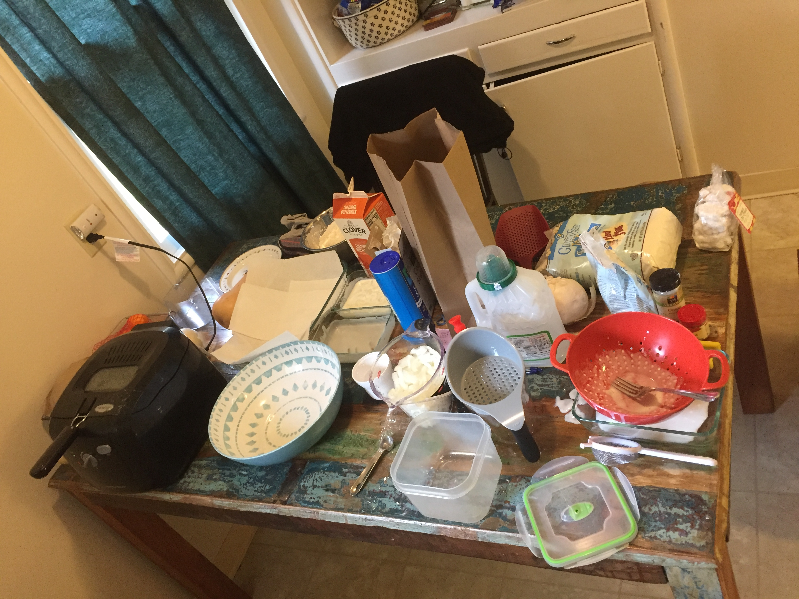

# French Fried Onions (Gluten Free, Egg Free)

## Ingredients

* White onions 2-3 per casserole
* 1.89 liters of vegetable oil
* 1 quart buttermilk (or whole milk)
* 1 cup bob red mill all purpose flour
* 1 cup corn starch
* 1 tsp sea salt
* 1 tsp garlic powder
* 1 tsp onion powder
* 1 tsp paprika
* Pepper to taste

## Instructions

1. Set up table as pictured below
1. Cut onions first
1. Mix dry ingredients and set aside
1. Pour milk in a container the size of the frying basket
1. Cut onions to size
1. Soak a basketful of raw onions in milk
1. While they soak, Fill fryer to max with oil
1. Preheat fryer to 300-310 degrees
1. Remove onions and toss in dry mix and let sit for a moment
1. Start a new batch of onions soaking
1. Put the basket in the fryer
1. Carefully place each freshly battered onion slice into the basket already submerged
1. Cook for 5 minutes per batch

## Tips and Hacks

- On Thanksgiving 2019 I used Pamela’s baking and pancake mix made with almond meal instead of bob’s red mill. It turned out really well, if slightly lighter in color than we like.

## Pics of Setups

