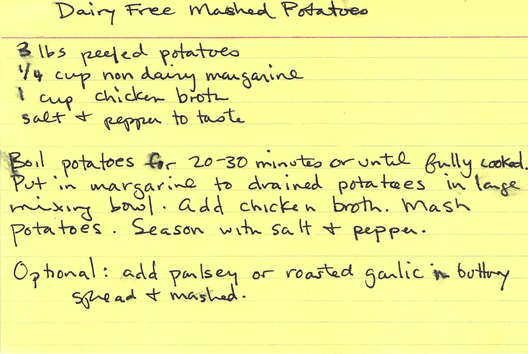

# Mashed Potatoes

## Ingredients

* About 3 lbs russett potatoes (the pictures below show about 3.5 lbs of potatoes)
* 1/4 cup butter (or margarine)
* 1 cup chicken broth
* salt
* pepper

## Instructions

1. peel off roughly 90% of the peel on the potatoes. If you notice any blackish spots deep under the layer of white, try and peel at them until they go away. (pic)
1. cut each potato into four evenly-sized pieces to allow for cooking to happen faster and more evenly. (pic)
1. In a large heavy bottom pot, add enough cold water to cover potatoes.
1. Boil potatoes for 20-30 minutes or until fully cooked. Test how well they are done by checking that a fork can go through it without uneven resistance.
1. When the potatoes are done boiling, strain in a strainer and then put immediately back into the same, still-hot pot.
1. Quickly throw in the butter in pieces and mix together until the butter is mostly melted.
1. Add chicken broth to the pot.
1. Mash potatoes.
1. If it's not creamy enough for your taste, add small amounts of equal parts butter and broth while continuing to stir until you get the consistency that your heart (or stomach) desires.
1. Season with salt & pepper to taste

## Tips

- **Start potatoes in cold water.** Potatoes are dense and require more time to heat all the way through. Dropping them into boiling water is a bad idea because the hot water will cook the outsides of the potatoes faster than the insides, leaving you with unevenly cooked taters. (https://www.tastingtable.com/cook/national/how-to-boil-potatoes-start-cold-water)
- Cutting potatoes into smaller pieces will allow the heat to penetrate their denseness and cook them more quickly. The faster you need to cook them, the smaller you should cut into pieces before you start to boil.
- I use a fork to stab at the thickest piece of potato I can see in the pot. If the fork slips through easily to the other side, it's probably done. If the potato flakes and practically falls apart when you try this, it is DEFINITELY done and you need to get it out of the water already!
- I like to use a potato masher in one hand, and a wooden spoon in the other to do the mashing while I let the pot roam in front of me on the stove in revolt of my machinations. I like to press the large potato pieces against the corners of the metal pot with the wooden spoon to crush them. It is very satisfying.

## Variations

- Make it dairy-free by substituting butter for dairy-free margarine, and milk for a milk alternative like rice milk.
- Add parsley for

## Credits

This recipe was largely based on a recipe Marimikel Charrier wrote up on this index card, based on her father Mike Charrier's recipe. The picture of this index card was taken in March 2011, but the recipe itself is likely to be much, much older.

